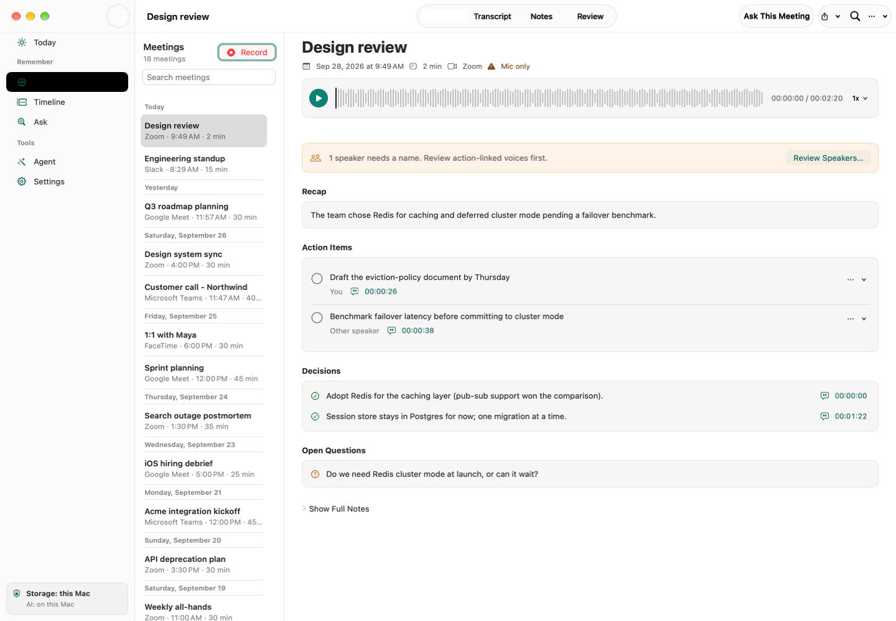
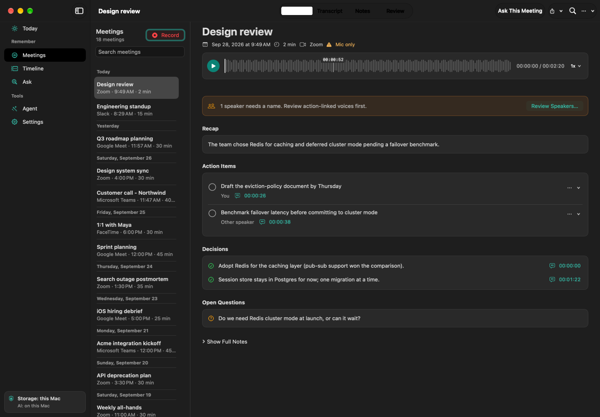

# Native UI refresh previews

Representative light and dark captures of the refreshed Meetings workspace,
captured on 28 September 2026. These are real SwiftUI views populated with
synthetic data in an isolated library. They do not contain user meeting data.

| Light | Dark |
| --- | --- |
|  |  |

These are in-process documentation captures, not interactive UI test results.
AppKit's `cacheDisplay` renderer cannot composite some native sidebar and
segmented-control selection materials, so those selections appear black and
some controls appear inactive. See the [screenshot kit](../../../Docs/screenshot-kit.md).

The complete local validation gallery contains 34 captures covering 17 surfaces
in both appearances under the ignored `Artifacts/redesign-validation/` directory.
